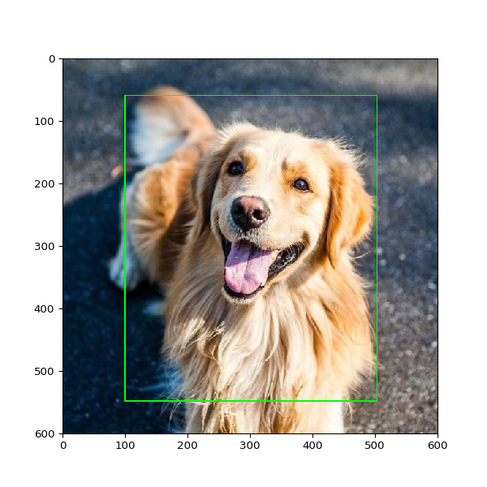

## This repo for cutting objects from images to separate folder.
Labels for cutting get from YOLO labels .txt files




```
python3 cut_yolo_bbox.py \
--labels_pth '/Volumes/labels/' \
--imgs_pth '/Volumes/images/' \
--out_pth '/Volumes/cutted_out/' \
--zamena 0=stand,1=laiyng
```

```
--labels_pth   path where located txt YOLO files  
--imgs_pth     path where located images files  
--out_pth      path where will save croped images
--classes      dictionary *--classes 0=stand,1=laiyng* 

if YOLO label is **0** it mean that final destination is 
path(/out_pth/ +  **stand**/ ....)   folder == is stand
if YOLO label is **1** it mean that final destination is 
path(/out_pth/ +  **laiyng**/ ....)  folder == is lying
```

Exapmle commands
```
python3 cut_yolo_bbox.py \
--labels_pth '/Volumes/ADATA/SetElderly/' \
--imgs_pth '/Volumes/ADATA/SetElderly/' \
--out_pth '/Volumes/ADATA//join/' \
--classes 0=stand,1=laiyng
```


python3 cut_yolo_bbox.py \
--labels_pth '/home/yaroslav/Documents/001_Projects/005_car_number/001_data/001_raw_data/005_google_view/train/labels' \
--imgs_pth '/home/yaroslav/Documents/001_Projects/005_car_number/001_data/001_raw_data/005_google_view/train/images' \
--out_pth '/home/yaroslav/Documents/001_Projects/005_car_number/001_data/001_raw_data/005_google_view/train/cropp_yolo' \
--classes 0=0,1=1,2=2,3=3,4=4,5=5,6=6,7=7,8=8,9=9


python3 cut_yolo_bbox.py \
--labels_pth '/Volumes/Orico/projetcs_sbs/001_green-houses/001_DS_models/003_tomatos/003_tomatoes_ripeness_stage/001_raw_data/003_002_Kaagle_Ripe_Unripe_binary/002_raw_data_img/Riped_and_Unriped_Tomato_Dataset/labels' \
--imgs_pth '/Volumes/Orico/projetcs_sbs/001_green-houses/001_DS_models/003_tomatos/003_tomatoes_ripeness_stage/001_raw_data/003_002_Kaagle_Ripe_Unripe_binary/002_raw_data_img/Riped_and_Unriped_Tomato_Dataset/images' \
--out_pth '/Volumes/Orico/projetcs_sbs/001_green-houses/001_DS_models/003_tomatos/003_tomatoes_ripeness_stage/001_raw_data/003_002_Kaagle_Ripe_Unripe_binary/002_raw_data_img/cropped' \
--classes 0=riped,1=unriped