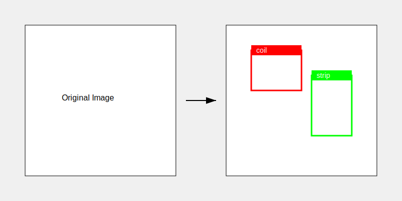

# 🎯 YOLO Label Visualizer

Simple yet powerful tool for visualizing YOLO format labels on images with customizable styling.


## 🚀 Features


- 📊 Visualize YOLO format labels (.txt) on images
- 🎨 Customizable colors for each class
- 📏 Adjustable box and font settings
- 📈 Detailed processing statistics
- 🔄 Preserves directory structure

## ⚙️ Quick Start

1. Install dependencies:
```bash
pip install -r requirements.txt
```

2. Configure `config.yaml`:
```yaml
src_imgs: "path/to/images"
src_labels: "path/to/labels"
dst_imgs: "path/to/output"
classes:
  - "coil"
  - "top_backround"
  - "top_target"
  - "strip"
colors:
  - [0, 0, 255]    # red
  - [171, 0, 111]  # green_white
  - [255, 0, 18]   # dark blue
  - [236, 255, 1]  # green_white

# Optional display settings
box_thickness: 4    # box line thickness
font_scale: 2       # font size
font_thickness: 4   # font line thickness
```

3. Run visualization:
```bash
python visualize_yolo.py
```

## 📊 Statistics Output

After processing, you'll get detailed statistics:
```
=== Processing Statistics ===
Total images found: 64
Successfully processed images: 64
Images with labels: 64
Total bounding boxes: 256
Boxes per class:
  coil: 64
  top_backround: 64
  top_target: 64
  strip: 64
```

## 🛠️ Requirements

- Python 3.6+
- OpenCV
- PyYAML
- tqdm

## 📝 License

MIT License - feel free to use in your projects!

