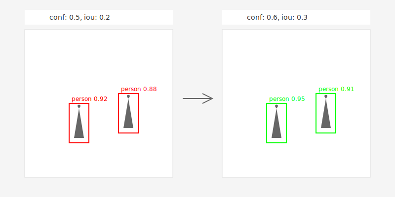

# Image Concatenation Tool

A Python script that concatenates images from multiple directories horizontally and adds text labels above each image.

## Description
The tool takes images with matching names from different source directories, combines them horizontally, adds a text label above each image in a white padding area, and saves the result to a destination directory.



## Requirements
- Python 3.x
- OpenCV (cv2)
- PyYAML
- NumPy

## Installation
```bash
pip install opencv-python pyyaml numpy
```

## Configuration
Create a `config.yaml` file:
```yaml
001_src: "path/to/first/directory"
001_printed_text: "conf 0.5, iou 0.2"
002_src: "path/to/second/directory"
002_printed_text: "conf 0.6, iou 0.3"
dst: "path/to/output/directory"
```

## Features
- Concatenates images horizontally
- Adds white padding area at the top
- Centers text labels above each image
- Processes all matching images from source directories
- Supports dynamic number of input directories (minimum 2)

## Usage
```bash
python combine_images.py
```

## Output
- Creates combined images in the specified destination directory
- Each output image contains:
  - White padding area at the top with text labels
  - Horizontally concatenated source images
  - Original image filename preserved

## Notes
- All source directories must contain images with matching filenames
- Supports common image formats (jpg, jpeg, png)
- Text labels are centered above corresponding images
- Automatically handles images of different heights