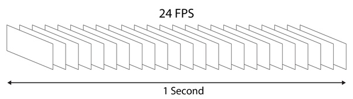

# Grab frames from video/videos


Требуеться указать переменные в argparse при запуску скрита

## Command for run  

```
python3 grab_frame.py --src /cam_videos --dst /out_frames --rate 20
```


### Переменные
- '-s', '--src'  - source где лежит 1 видео или несколько видеофайлов  
- '-d','--dst'   - distanation в какую папку сохранять  
- '-r', '--rate' - частота захвата 1 - захватывать каждый кадр не пропуская, 25 -  захватывать каждый 25 кадр  


python3 grab_frame.py --src /Volumes/Orico/projetcs_sbs/001_green-houses/001_DS_models/002_tops/001_tops_detection/001_raw_data/007_Dima_20_11_24_TkPodmoskovie_video/001_raw_vids/videos_20-11-2024/1 --dst /Volumes/Orico/projetcs_sbs/001_green-houses/001_DS_models/002_tops/001_tops_detection/001_raw_data/007_Dima_20_11_24_TkPodmoskovie_video/002_raw_data_img --rate 10

python3 grab_frame.py --src /cam_videos --dst /out_frames --rate 20


python3 grab_frame.py --src /Volumes/Orico/projetcs_sbs/001_green-houses/001_DS_models/002_tops/001_tops_detection/001_raw_data/011_ECO_C_january_2025/001_raw_vids --dst /Volumes/Orico/projetcs_sbs/001_green-houses/001_DS_models/002_tops/001_tops_detection/001_raw_data/011_ECO_C_january_2025/002_raw_data_img/out_freq5 --rate 5