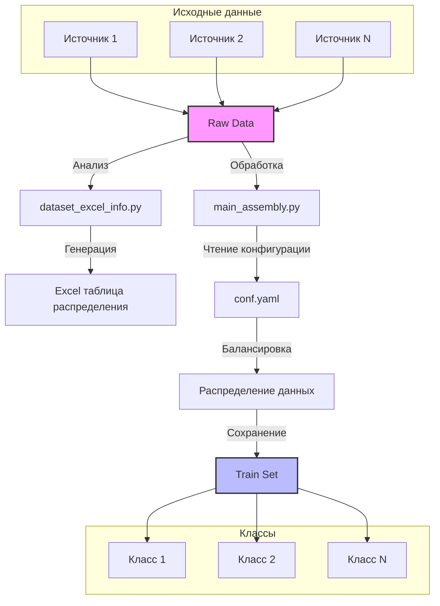
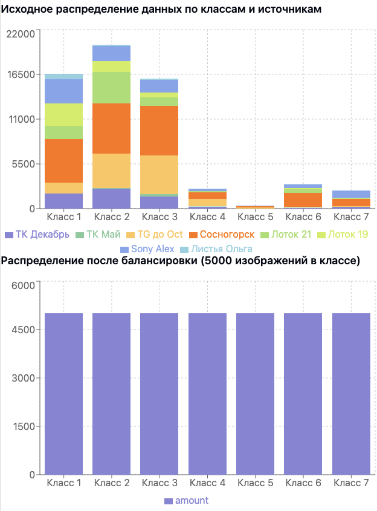

# Инструмент для подготовки датасета листьев

Этот проект представляет собой набор инструментов для подготовки и анализа датасета изображений листьев для задач компьютерного зрения. Проект включает в себя функционал для анализа распределения данных, балансировки классов и создания тренировочных наборов данных.

## Структура проекта

```
├── conf.yaml                 # Конфигурационный файл
├── dataset_excel_info.py     # Скрипт анализа датасета
├── main_assembly.py          # Главный скрипт сборки датасета
└── utils/
    ├── distribute_sum.py     # Алгоритм распределения сумм
    ├── recount_distribute_sum.py
    ├── save_trainset.py      # Сохранение тренировочного набора
    └── tools.py              # Вспомогательные функции
```

## Процесс обработки данных

Процесс обработки и подготовки данных состоит из нескольких этапов:

[Data Flow Diagram](./md_links/data-flow-diagram.mermaid)


## Основные компоненты

### 1. dataset_excel_info.py

Скрипт для анализа структуры датасета и создания Excel-таблицы с информацией о распределении классов. Анализирует количество изображений в каждом классе для каждого источника данных.

Пример выходных данных:
```
|                           | 1    | 2    | 3    | 4   | 5   | 6    | 7   |
|---------------------------|------|------|------|-----|-----|------|-----|
| 002_001_AM_trip_dec_2023 | 1860 | 2439 | 1481 | 222 | 34  | 107  | 194 |
| 002_004_ECO_cult_2024    | 0    | 109  | 317  | 40  | 0   | 57   | 2   |
```

### 2. main_assembly.py

Главный скрипт для создания сбалансированного тренировочного набора данных.

#### Входные параметры:
- `list_names`: список папок с данными
- `amount_in_class`: требуемое количество изображений в каждом классе

#### Выходные данные:
- Структурированный набор данных для обучения
- Равномерное распределение изображений из разных источников
- Соблюдение ограничения на максимальное количество изображений в классе

## Настройка и использование

1. Настройте конфигурацию в файле `conf.yaml`:
```yaml
path_data: "/path/to/data"
path_final_data: "path_final_data.txt"
amount_in_class: 5000
classes: [1, 2, 3, 4, 5, 6, 7]
```

2. Запустите анализ датасета:
```bash
python dataset_excel_info.py
```

3. Соберите тренировочный набор:
```bash
python main_assembly.py
```

## Алгоритм распределения

При создании тренировочного набора используется специальный алгоритм распределения, который:
- Сохраняет все изображения из источников с малым количеством данных
- Равномерно распределяет оставшееся количество между крупными источниками
- Обеспечивает случайный выбор изображений из каждого источника




## Требования к окружению

- Python 3.9+
- pandas
- numpy
- PyYAML
- natsort
- tqdm

## Лицензия

MIT License

## Авторы

- Команда разработчиков

