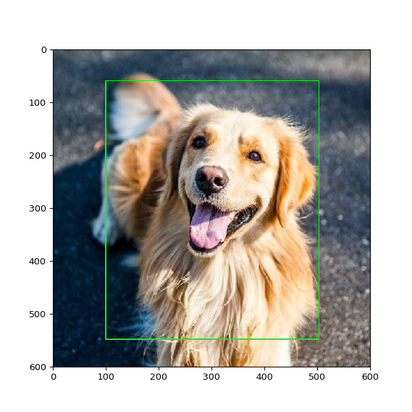

## This repo for cutting objects from images to separate folder.
Labels for cutting get from YOLO labels .txt files




```
python3 cut_yolo_bbox.py \
--labels_pth '/Volumes/labels/' \
--imgs_pth '/Volumes/images/' \
--out_pth '/Volumes/cutted_out/' \
--zamena 0=stand,1=laiyng
```

```
--labels_pth   path where located txt YOLO files  
--imgs_pth     path where located images files  
--out_pth      path where will save croped images
--zamena       dictionary *--zamena 0=stand,1=laiyng* 

if YOLO label is **0** it mean that final destination is 
path(/out_pth/ +  **stand**/ ....)   folder == is stand
if YOLO label is **1** it mean that final destination is 
path(/out_pth/ +  **laiyng**/ ....)  folder == is lying
```

Exapmle commands
```
python3 cut_yolo_bbox.py \
--labels_pth '/Volumes/ADATA/SetElderly/' \
--imgs_pth '/Volumes/ADATA/SetElderly/' \
--out_pth '/Volumes/ADATA//join/' \
--zamena 0=stand,1=laiyng
```