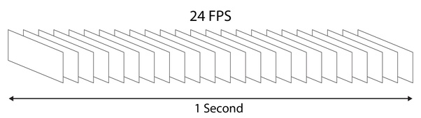

# Grab frames from video/videos


Требуеться указать переменные в argparse при запуску скрита

## Command for run  

```
python3 grab_frame.py --src /cam_videos --dst /out_frames --rate 20
```


### Переменные
- '-s', '--src'  - source где лежит 1 видео или несколько видеофайлов  
- '-d','--dst'   - distanation в какую папку сохранять  
- '-r', '--rate' - частота захвата 1 - захватывать каждый кадр не пропуская, 25 -  захватывать каждый 25 кадр  


python3 grab_frame.py --src /cam_videos --dst /out_frames --rate 20